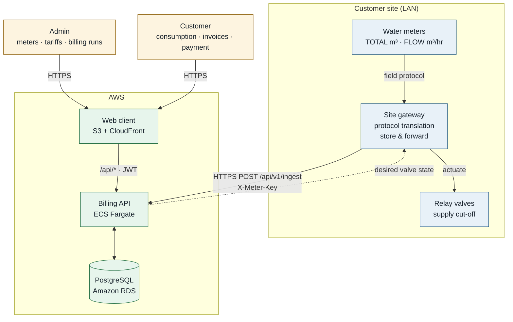
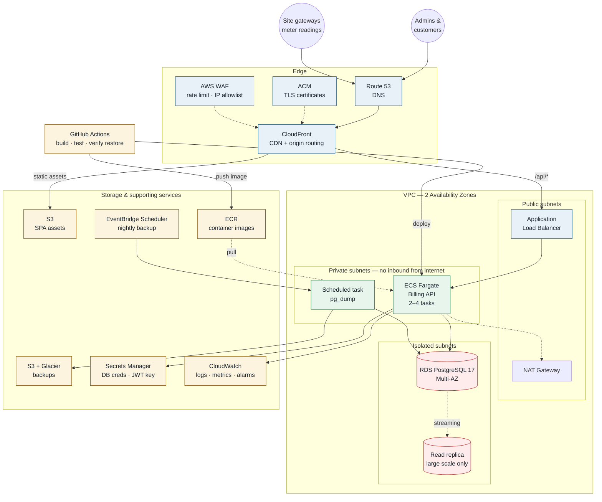
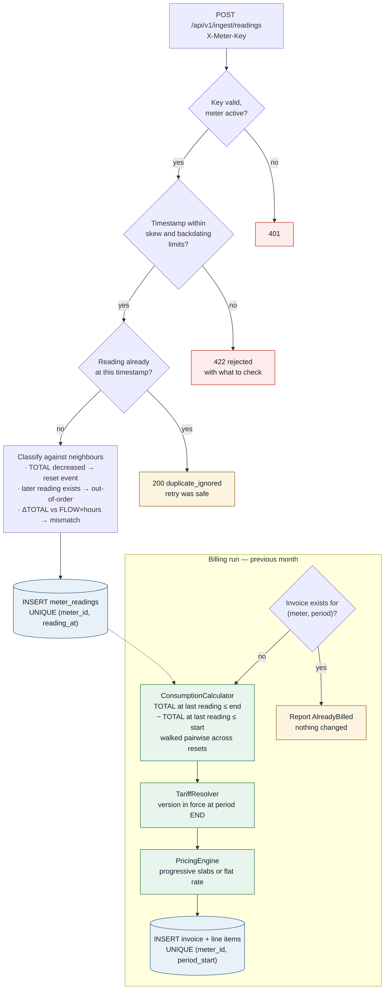
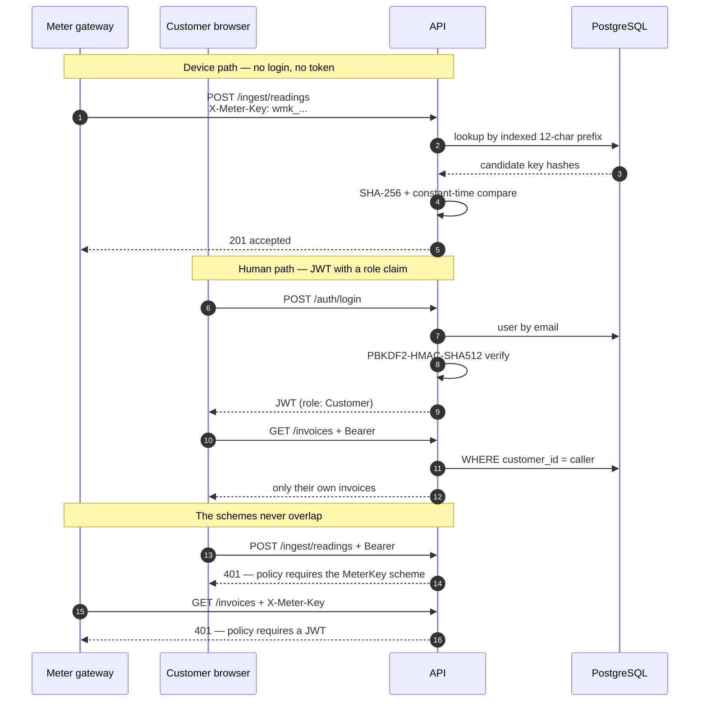
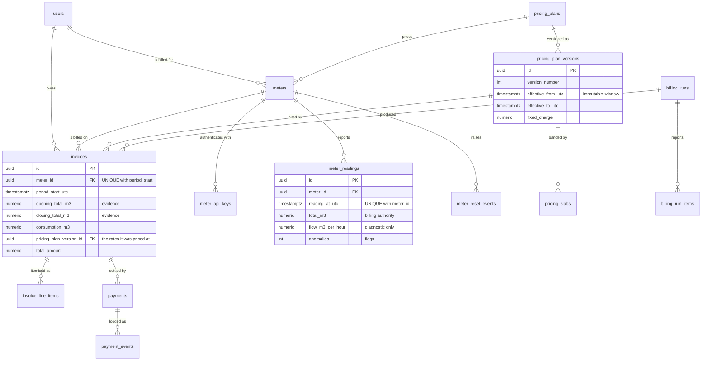

# Architecture

Four diagrams, each answering a different question. They render natively on GitHub.

- [System context](#system-context) — who talks to what
- [AWS deployment](#aws-deployment) — the services and how traffic flows
- [Ingestion and billing](#how-a-reading-becomes-an-invoice) — the mechanism that decides what a customer pays
- [Authentication](#two-authentication-schemes) — why a meter key cannot read an invoice
- [Data model](#data-model) — the schema

---

## System context

The gateway exists because meters rarely speak HTTP. It translates Modbus/M-Bus/
LoRaWAN into the REST contract, and buffers readings when the link drops — which is
why ingestion accepts out-of-order arrival and batch upload.

---

## AWS deployment

**What changes versus running locally:** the `web` container disappears. On a laptop
nginx serves the SPA and proxies `/api`; on AWS CloudFront does both jobs — static
assets from S3, `/api/*` to the ALB. Same single origin, so still no CORS anywhere,
but one fewer container to run and pay for.

Service choices and the reasoning behind each are in
[`deployment.md`](deployment.md); costs are in
[`infrastructure-sizing.md`](infrastructure-sizing.md).

---

## How a reading becomes an invoice

The mechanism that decides what a customer pays. Consumption is **derived**, never
accumulated — see [ADR-0003](adr/0003-immutable-readings-and-consumption.md).

Three properties fall out of this shape:

- **Retry is safe.** A duplicate returns `200 duplicate_ignored`, not an error, so a
  meter that retries after a timeout cannot corrupt anything.
- **Arrival order is irrelevant.** Consumption reads the time-ordered series, so a
  late reading changes nothing about which invoice it belongs to.
- **Re-running a billing period is safe.** The unique index makes double-billing
  impossible at the storage layer rather than unlikely in application code.

---

## Two authentication schemes

The last two exchanges are the point: "a device credential cannot read invoices, and
a customer token cannot post readings" is enforced by the authorization policy, not
by remembering to check in each handler. Both are covered in the
[API walkthrough](api-walkthrough.http).

---

## Data model

Two tables are never deleted from and never updated: `meter_readings` is the ledger
every invoice is reproducible from, and `pricing_plan_versions` must stay resolvable
for the life of any invoice citing it. Full policy in
[ADR-0010](adr/0010-soft-delete-policy.md).
