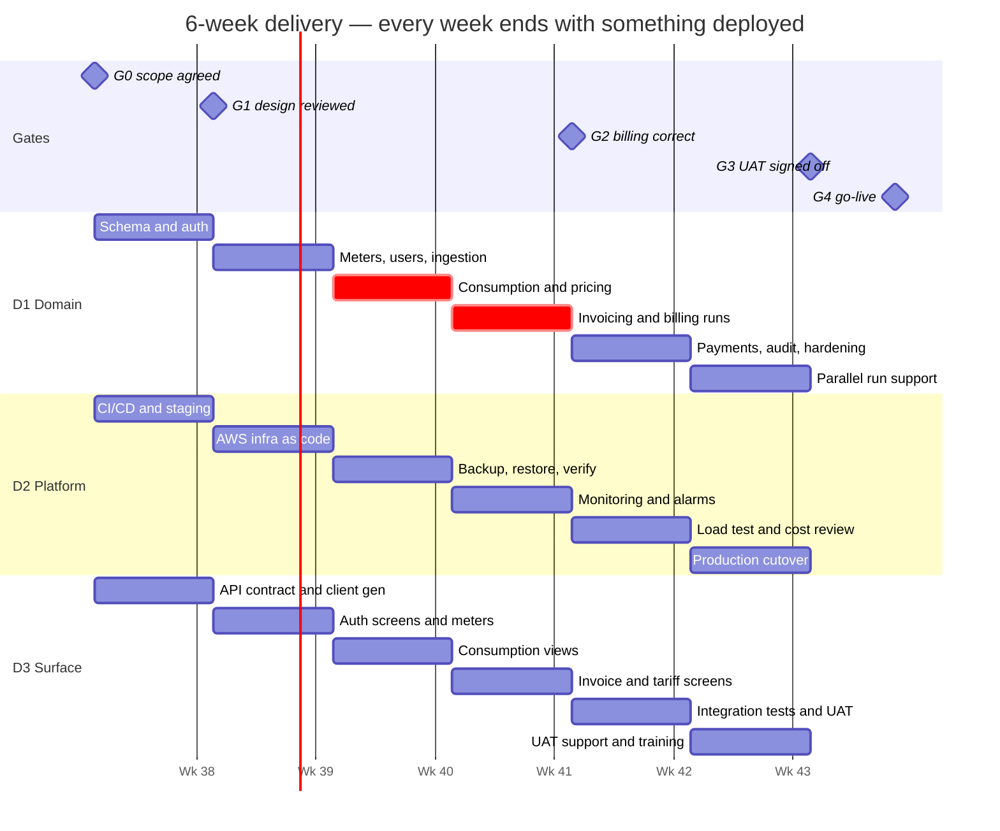

# Delivery plan — 6 weeks, 3 developers, shipping continuously

**Context:** high-growth startup. Hard external deadline, deployments multiple times
a day, and a team small enough that every person is a single point of failure.

**On the waterfall requirement.** The brief asks for a waterfall plan. Waterfall's
value is its *decision gates* — points where someone with authority says "this is
agreed, we are building it." Waterfall's cost is its *serialisation* — nobody
integrates until the phase before finishes. This plan keeps every gate and discards
the serialisation, because a startup that cannot deploy for five weeks does not find
out it was wrong until week six. The gate-by-gate mapping is in
[Waterfall gates, preserved](#waterfall-gates-preserved), and the pure-serial
variant — which is what a regulated customer procuring hardware would require — is
in [The pure waterfall variant](#the-pure-waterfall-variant).

---

## Team

Three developers, so specialisation is a bias rather than a boundary. Everyone
reviews everyone.

| | Owns | Backs up |
|---|---|---|
| **D1 — Domain & billing** | Consumption, pricing, invoicing, data model. Tech lead; final call on design. | D3 on the API surface |
| **D2 — Platform** | CI/CD, AWS, backup/restore, monitoring, on-call rota | D1 on migrations |
| **D3 — Product surface** | API endpoints, web client, test automation, docs | D2 on deploys |

**Bus factor is 1 in every area.** Mitigated by ADRs written as decisions are made
(not afterwards), and by pairing on the billing engine specifically — the one area
where a defect costs money rather than time.

---

## How the team works

| Practice | Specifics |
|---|---|
| Branching | Trunk-based. Branches live hours, not days. Merge to `main` is the unit of progress. |
| Deployment | Every merge auto-deploys to staging. Production deploys on demand, expected daily. |
| Incomplete work | Behind feature flags, merged anyway. Long-lived branches are the thing we are avoiding. |
| Sprint length | **1 week.** Monday planning (30 min), Friday demo on staging. |
| Standup | 10 minutes, async in Slack unless something is blocked. |
| Review | Every PR reviewed. Migrations and anything touching money need **two** approvals. |
| Definition of done | Merged, deployed to staging, monitored, and documented. Not "works on my machine". |

### Deployment pipeline

```
push → build + test + client-drift check + restore-verify   (~6 min)
     → image to ECR, tagged by SHA
     → auto-deploy staging
     → smoke test
     → [manual approve] → production rolling deploy
     → CloudWatch alarm on 5xx → automatic rollback
```

Rollback is a task-definition revert, two to three minutes. That is what makes
daily production deploys reasonable rather than reckless — see
[deployment.md](deployment.md#rollback) for the migration caveat, which is the part
that genuinely cannot be rolled back by redeploying.

### Targets (DORA)

| Metric | Target | Why this number |
|---|---|---|
| Deployment frequency | ≥ 1/day to production | Below this, batch sizes grow and each release gets riskier |
| Lead time, commit → production | < 2 hours | Longer means the pipeline is the bottleneck, not the work |
| Change failure rate | < 15% | Above this, we are deploying faster than we can verify |
| MTTR | < 30 min | Automatic rollback makes this achievable; it is a pipeline property, not heroics |

---

## Schedule



### What ships each week

A week that ends with nothing deployed is a week we cannot get feedback on.

| Week | Ships to staging | Gate |
|---|---|---|
| **0** (3 days) | — | **G0** Scope and tariff rules agreed in writing |
| **1** | Auth working; a reading posts and reads back; pipeline green end to end | **G1** Design and API contract reviewed |
| **2** | Admin creates users and meters; ingestion hardened; demo data seeded | |
| **3** | Consumption visible per meter and per month; pricing engine tested | |
| **4** | **First invoice generated** from real readings; billing run reports per meter | **G2** Billing verified against hand calculations |
| **5** | Customer-facing web client; backup executed and restore drilled | |
| **6** | Production; parallel run against the incumbent process begins | **G3** UAT · **G4** Go-live |

**Week 4 is the pivot.** Everything before it builds toward a correct invoice;
everything after it is surface and operations. If week 4 slips, the deadline moves —
no amount of UI recovers an invoice that bills the wrong amount.

---

## Scope triage

Agreed at G0 and enforced at every gate. The point of writing this down on day one
is that cutting scope in week 5 is then a *decision already made*, not a negotiation
under pressure.

| | Scope | Status |
|---|---|---|
| **Must** — no launch without | Auth and roles · users · meters · REST ingestion · consumption · fixed and slab pricing · previous-month invoicing · invoice viewing · docs | All shipped |
| **Should** — cut only if week 4 slips | Web client · soft deletes · payments · supply cut-off · audit log | All shipped |
| **Could** — first to go | CSV bulk ingestion · invoice PDFs · admin tariff editor UI | Cut |
| **Won't** — explicitly out | Water tanks · webhooks · meter mTLS · automated cut-off policy · multi-tenancy | Deferred, with reasons in the README |

**Anything a stakeholder asks for after G0 goes to the backlog, not into this
release.** Weekly staging demos make that a conversation about *when*, not *whether*
— which is the only version of that conversation that ends well.

---

## What deadline pressure does not get to touch

Everything above is negotiable. This is not, and it is a short list precisely so it
holds when the week is bad:

| Non-negotiable | Why |
|---|---|
| **Boundary tests on consumption and pricing** | These decide what a customer is charged. A bug here is refunds, a regulator conversation and lost trust — not a hotfix. 32 tests, including every band edge. |
| **Authorization tests on every customer-facing route** | One missing scope check leaks another customer's billing data. That is a disclosure incident, not a bug. |
| **Backup restore verified in CI** | A backup nobody has restored is a hypothesis. This costs 90 seconds per push. |
| **Migrations reviewed by two people** | The one change that cannot be rolled back by redeploying. |
| **Idempotency on ingestion and billing** | Enforced by unique indexes, so it survives any future refactor by someone who has not read this document. |

Everything else — UI polish, test coverage elsewhere, refactors, documentation
depth — is negotiable against the deadline, and we say so out loud rather than
pretending otherwise and quietly cutting the wrong thing at 11pm.

---

## Technical debt ledger

Debt taken deliberately, each with a payback date. Debt without a date is not a
decision, it is a hope.

| # | Debt | Why we took it | Payback | Cost if ignored |
|---|---|---|---|---|
| T1 | No integration tests against real PostgreSQL | Domain tests cover the money path; index-level guarantees verified by hand | **Week 7** | A refactor silently breaks idempotency; nothing catches it |
| T2 | Token in `sessionStorage`, not an httpOnly cookie | Cookie + CSRF is a day we did not have | Week 8 | XSS becomes account takeover |
| T3 | Migrations run at application startup | Correct for one instance; documented threshold in ADR-0008 | Before the second API replica | Concurrent startup migrations race |
| T4 | Terraform not committed | Infrastructure built once, by hand, under deadline | Week 7, before a second environment | Environment drift; no reproducible rebuild |
| T5 | Payments use a mock provider | Real PSP integration needs contracts and compliance we do not have | Post-launch, gated on commercial | No revenue collection |
| T6 | No load test above 2× expected volume | Arithmetic says 0.33 writes/sec; measurement would be better | Week 6 | Sizing assumptions unvalidated |

Reviewed at every Monday planning. **Items past their payback date block new feature
work** — that rule is the only thing that stops a ledger becoming a wishlist.

---

## Risk register

| # | Risk | P | I | Owner | Mitigation | Trigger |
|---|---|---|---|---|---|---|
| R1 | Meter protocol differs from documentation | **High** | **High** | D3 | Hardware-in-the-loop spike in week 0, before any design is fixed | Spike cannot read a real meter by end of week 1 |
| R2 | Tariff rules ambiguous or change mid-build | Med | **High** | D1 | Versioned immutable tariffs, so a change is a new version rather than a migration; signed off at G0 | Any tariff change request after G0 |
| R3 | Scope creep from weekly demos | **High** | Med | D1 | Backlog, not this release. MoSCoW agreed at G0 and re-read at each gate | Two or more additions requested in one week |
| R4 | Billing defect reaches production | Low | **High** | D1 | Non-negotiable test floor; parallel run before cutover; invoices store their full breakdown so any figure is traceable | Any variance in the parallel run |
| R5 | Key person unavailable | Med | **High** | All | ADRs written as decisions are made; pairing on billing; runbooks in the repo | Any absence over 2 days |
| R6 | Frequent deploys raise change failure rate | Med | Med | D2 | Feature flags, automatic rollback on 5xx, change failure rate tracked weekly | Change failure rate above 15% in any week |
| R7 | Sustained overtime degrades quality | Med | **High** | D1 | **Cut scope, not weekends.** The MoSCoW list exists for this | Any week above 45 hours for anyone |
| R8 | AWS cost exceeds estimate | Med | Med | D2 | Budget alarms from week 1; cost reviewed at each gate against infrastructure-sizing.md | Any month above 120% of estimate |
| R9 | Customer unavailable for UAT | Med | Med | D3 | UAT dates booked at G0, not week 5 | No confirmed participants by week 4 |

R7 is the one most often left off a startup plan. Overtime is not a mitigation for
under-estimation; it is a way of converting a schedule problem into a quality problem
and a retention problem at the same time.

---

## Waterfall gates, preserved

The brief's phases map onto this schedule as decision gates. Each has entry
criteria, a named approver, and the authority to stop the release.

| Waterfall phase | Gate | When | Approver | Exit criteria |
|---|---|---|---|---|
| Requirements | **G0** | End of week 0 | Customer stakeholder | Functional and non-functional requirements agreed; **tariff rules unambiguous**; MoSCoW signed; UAT dates booked |
| Design | **G1** | End of week 1 | Tech lead + customer IT | ADRs written; schema and API contract reviewed; meter spike has read a real device; infrastructure sized and costed |
| Implementation | — | Weeks 1–5 | — | Continuous. Not a gate, because gating integration is the specific failure this plan avoids |
| Integration & test | **G2** | End of week 4 | Tech lead | Invoices verified against hand calculations; authorization matrix tested; restore drill timed and passed |
| | **G3** | End of week 6 | Customer stakeholder | UAT signed off; zero open critical or high defects |
| Deployment | **G4** | Week 6 | Customer stakeholder | Production live; backups verified on the real environment; parallel run started |
| Maintenance | — | Ongoing | — | On-call rota, debt ledger, quarterly restore rehearsal |

**The tariff gate (G0) is the strict one.** "Slab based, like electricity meters" is
not a specification — it is ambiguous between progressive and whole-volume pricing,
which produce different bills for the same consumption
([ADR-0004](adr/0004-versioned-pricing-and-invoice-snapshots.md)). Resolving that in
week 0 costs an hour. Discovering it in week 5 costs a re-bill and a credibility
problem.

---

## The pure waterfall variant

Some customers require genuine serialisation: a regulator demanding documented
sign-off before implementation, or an on-premise deployment where hardware must be
specified and ordered before code is written. For those, the same six phases run
**12 weeks** instead of six:

| Phase | Weeks | Difference from the plan above |
|---|---|---|
| Requirements | 1–2 | Formal specification document, numbered and traceable |
| Design | 3–4 | Full design review and sign-off before any implementation |
| Implementation | 5–9 | No deployment until complete; integration deferred to phase 4 |
| Integration & test | 10–11 | First time components meet. **This is where the risk concentrates.** |
| Deployment | 12 | Hardware commissioning, parallel run |
| Maintenance | — | As above |

It costs six extra weeks and moves every integration surprise into the phase with the
least slack. It buys an audit trail some customers genuinely need. The hardware lead
time (four weeks, ordered in week 4) is what makes serialisation unavoidable in the
on-premise variant — on AWS, infrastructure is Terraform and arrives in a day, which
is most of why the compressed plan is possible at all.

---

## After week 6

| When | What |
|---|---|
| Weeks 7–8 | Pay down T1–T4. Feature work is blocked until the ledger is clear. |
| Week 8 | Post-launch review: what the estimates got wrong, and by how much |
| Week 9+ | Next increment — CSV ingestion, webhooks, tanks — at a sustainable cadence |
| Quarterly | Restore rehearsal by someone who did not write the procedure |
| Continuously | On-call rota, dependency patching, cost review against actual growth |

The first two weeks after launch are deliberately not feature weeks. A team that
ships a deadline and immediately starts the next one never pays the debt down, and
the third release is where that stops being survivable.
